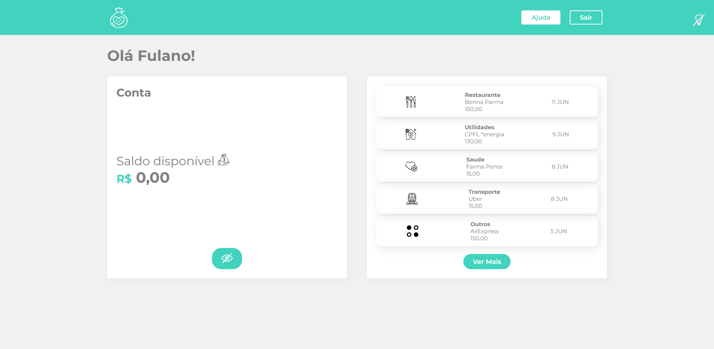

<h1 align="center">Smart Bank</h1>
<h4 align="center">Página web de um aplicativo bancário com tema light e dark</h4>
<h4 align="center">Feito com React.js</h4>

 &#xa0;

**
Sumário
**

<a href="#dart-sobre">Sobre</a> &#xa0; | &#xa0;
<a href="#books-O-que-eu-aprendi">O que aprendi</a> &#xa0; | &#xa0;
<a href="#white_check_mark-funcionalidades">Funcionalidades</a> &#xa0; | &#xa0;
<a href="#computer-tecnologias">Tecnologias</a> &#xa0; | &#xa0;
<a href="#hammer_and_wrench-serviços">Serviços</a>

<a href="#camera-imagens">Imagens</a> &#xa0; | &#xa0;
<a href="#orange_book-como-usar">Como usar</a> &#xa0; | &#xa0;
<a href="#scroll-pré-requisitos">Pré-requisitos</a> &#xa0; | &#xa0;
<a href="#link-links">Links</a> &#xa0; | &#xa0;
<a href="#sparkles-autor">Autor</a>

 &#xa0;
 
## :dart: Sobre

O principal objetivo do projeto foi aprender a utilizar a biblioteca Styled Components, que permite escrever códigos CSS dentro do JavaScript.

Consiste em uma página que se trata de um aplicativo bancário, permitindo o usuário mudar o tema das cores da aplicação.

Esse é um projeto do curso de Styled Components da <a href="https://www.alura.com.br/">Alura</a>.

&#xa0;

## :books: O que eu aprendi?

📌 Vantagens de utilizar o Styled Components para estilização;

📌 Criar arquivos de estilos em Styled Components;

📌 Enviar propriedades através do Styled Components para definir estilo;

📌 Utilizar arquivo GlobalStyle para estilos globais;

📌 Utilizar classes dentro de um componente do Styled Components;

📌 Reutilizar componentes de estilização;

📌 Criar na aplicação temas de cores com o Styled Components.

&#xa0;

## :white_check_mark: Funcionalidades
A principal funcionalidade do projeto é:

✔️ Permitir o usuário mudar o tema da página para light ou dark, através de um botão.

&#xa0;

## :computer: Tecnologias
* [HTML](https://developer.mozilla.org/pt-BR/docs/Web/HTML)

* [React.js](https://pt-br.reactjs.org/)

* [Styled Components](https://styled-components.com/)

&#xa0;

## :hammer_and_wrench: Serviços
* <a href="https://github.com/">GitHub</a>

* <a href="https://www.netlify.com/">Netlify </a>- hospedagem

* <a href="https://fonts.google.com/">Google Fonts </a>- importação da fonte

&#xa0;

## :camera: Imagens
**
Imagem do projeto:
**

  

&#xa0;

## :orange_book: Como usar

Acesse a aplicação pelo link.

Para alterar o tema da aplicação, basta clicar no botão com desenho de uma lâmpada, localizado no canto direito do cabeçalho.

&#xa0;

## :scroll: Pré requisitos
Para utilizar o sistema, basta um navegador de sua preferência e conexão com internet.

&#xa0;

## :link: Links
* Repositório: https://github.com/CaioAugustoHD/Smart-Bank
* Deploy: https://projeto-smartbank.netlify.app/

&#xa0;

## :sparkles: Autor

<h4>Feito por Caio Augusto Pereira</h4>

&#xa0;

 

